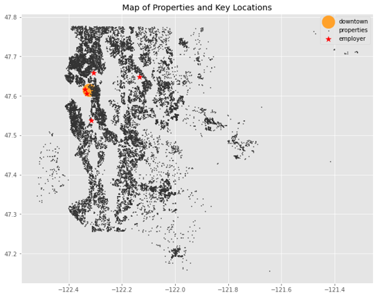
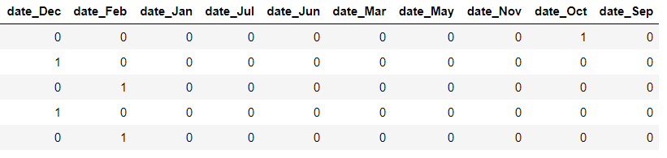
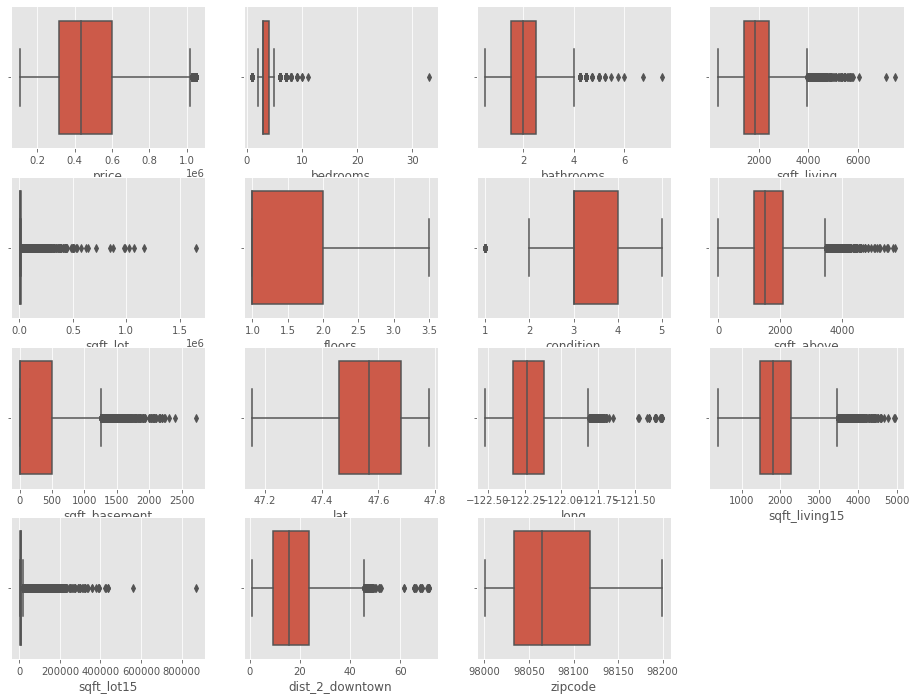
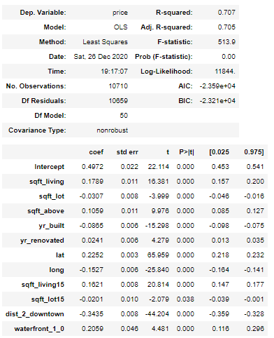
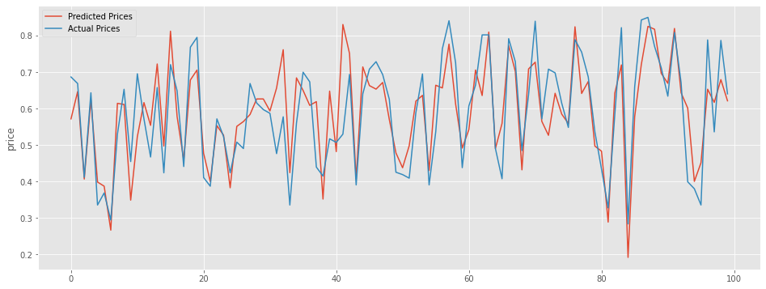
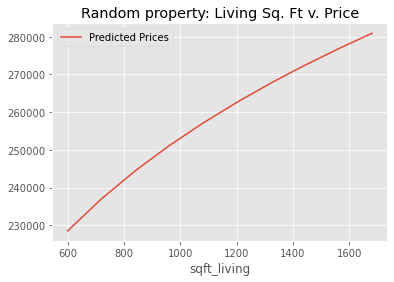
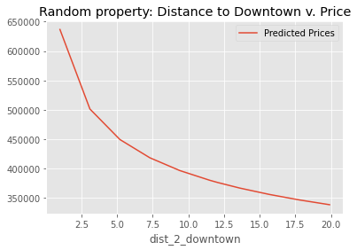
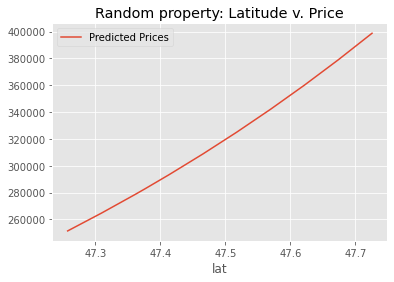
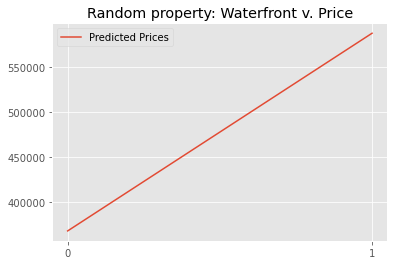

# Phase 2 Project - King County, WA Housing Market

## Final Project Submission

* Student name: Catherine Fritz
* Student pace: part time
* Scheduled project review date: December 18, 2020
* Instructor name: Amber Yandow

### Business Understanding
Between 2016 and 2019, Seattle’s population increased by 134,000. Per the U.S. Department of Labor & Statistics: “Software Developers, Software Quality Assurance Analysts and Testers” was Seattle’s largest occupation category in 2019.

I wanted to see if I could help workers new or moving to Seattle area to understand what are the major influences on housing prices. Target is Software Developers, Software Quality Assurance Analysts and Testers with a Salary Range: $64,240 -$164,590 (U.S. Department of Labor and Statistics). 

Therefore, I will limit property prices between $105,000 and $1,000,000 based on mortgage recommendations for salary (www.mortgagecalculators.info).

To accomplish this, I will utilize the CRISP-DM method to create a multivariate linear regression model of the King County House Sales dataset.

### Data Understanding
The King County House Sales dataset provided information on the following features for each house:
* Date - date the house was sold
* Price - price as sold on prior date
* No. of bedrooms
* No. of bedrooms
* Square footage of the home
* Square footage of the lot
* No. of floors
* If the house has a view to a waterfront
* If the house been viewed
* How good the condition is ( Overall )
* Overall grade given to the housing unit, based on King County grading system
* Square footage of house apart from basement
* Square footage of the basement
* Year house was build
* Year when house was renovated (if renovated)
* Zip code
* Latitude coordinate
* Longitude coordinate
* The square footage of interior housing living space for the nearest 15 neighbors
* The square footage of the land lots of the nearest 15 neighbors

To get the top 10 employers, I looked at HUD data for the Seattle area, and then further narrowed the list down to the top 5 employers below with centralized campuses as opposed to many locations spread over the entire area. 

For each house, I calculated the average distance to each of these 5 employers and the distance of each house to the central downtown area to give two additional features:
* Average distance to a top 5 employer
* Distance to the center of downtown

Below is a plot of the houses in my narrowed dataset, along with the location of the employers and downtown. 

### Data Preparation 
The data was cleaned to turn numbers stored as strings into integers, fill in 0s where there was missing data or NaN, and also the dates were converted to a number representing the month so these features could be used in the regression. I also converted any categorical variable into dummy/indicator variables so that it would work in the model. Below is a snapshot of the dummies for the month a property was last sold.

For each house, I calculated the distance to each of these 5 employers and then recorded the average. I also calculated the distance of each house to the central downtown area. What I found is that because these employers are mainly downtown, the distances were relatively close, a snapshot of which is shown below. 

Because the distances I calculated and also the previously provided zip code, latitude, and longitude data are all different ways to measure distance, they ended up having high multicollinearity, as shown in the heatmap below. As a result, I kept the distance to downtown and latitude since it was a good representative of all the location features. 

Boxplots were used to eliminate outliers.

### Modeling
#### Model I
For my first model I included all the features and then dropped those with a p-value greater than 0.05, which indicates that the feature might not be significant. 

#### Model II
For my first refinement, I wanted to see what effect standardizing and normalizing my data would have. To normalize the data I used the log method, and to standardize the data I used the min-max method.

#### Model III
Despite standardizing and normalizing my data, I was still having residual normality and heteroscedasticity issues. To try and help this, I limited the range of my data to a narrower price range. 

### Evaluation
As predicted by my final R-squared value, the model is 70.9% accurate. Below is a snapshot of the model and predicted data vs. actual data.

Looking at top-weighted features:

For squarefoot livingspace, the % change in price by removing 200 sq. ft. was about -5%.

When increasing the property's distance from downtown:
- % change in price from 1-5 mi.: -18%
- % change in pricefrom 5-10 mi.: -12%
- % change in price from 10-15 mi.:-10%

For latitude, the % change in price by moving south 0.1 deg.: -10%.

For having a waterfront, the % change by removing waterfront % change: -35%.

### Recommendations
- Avoid a waterfront property
- Live at least 5 miles from downtown
- Live south of downtown
- Reduce square footage if necessary to stay in budget

### Deployment
For More Information, please review my full analysis in Jupyter Notebook or my presentation.

For any additional questions, please contact Catherine Fritz: cmfritz0@gmail.com.

## Repository Structure
#### Main Page
    ├── README.md                              <- The top-level README for reviewers of this project
    ├── resentation.pdf                        <- PDF version of project presentation
    ├── data.ipynb                             <- notebook used to generate data
    ├── analysis.ipynb                         <- master notebook
    ├── employment_data.ipynb                  <- additional graphs
    ├── data                                   <- folder where data exists
    ├── images                                 <- folder where data visualizations and graphics are located

#### Data
    ├── geodata.pkl                            <- pkl file from data.ipynb 
    ├── kc_house_data.csv                      <- housing data .csv file
    ├── top_employers.csv                      <- top employers .csv file

#### images
    ├── .png                                   <- various .png files
