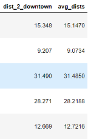

# Phase 2 Project - King County, WA Housing Market

## Final Project Submission

* Student name: Catherine Fritz
* Student pace: part time
* Scheduled project review date: December 18, 2020
* Instructor name: Amber Yandow

In this project, I wanted to focus on providing data to a home buyer looking to move to the Seattle to work and wanting to get a sense of the major influences on the costs of housing. To accomplish this, I will utilize the CRISP-DM method to create a multivariate linear regression model of the King County House Sales dataset.

### Business Understanding
With the target audience of those moving to Seattle to work, I assumed that someone looking at house prices would want to balance their commute with how much they would spend on a mortgage. I wanted to look at if a house's average distance to the top employers in the Seattle area influenced housing prices. Further for this audience, I made the assumption that this audience would be interested in 2 or fewer bedrooms and houses that cost less than $2 million. 

### Data Understanding
The King County House Sales dataset provided information on the following features for each house:
* Date - date the house was sold
* Price - price as sold on prior date
* No. of bedrooms
* No. of bedrooms
* Square footage of the home
* Square footage of the lot
* No. of floors
* If the house has a view to a waterfront
* If the house been viewed
* How good the condition is ( Overall )
* Overall grade given to the housing unit, based on King County grading system
* Square footage of house apart from basement
* Square footage of the basement
* Year house was build
* Year when house was renovated (if renovated)
* Zip code
* Latitude coordinate
* Longitude coordinate
* The square footage of interior housing living space for the nearest 15 neighbors
* The square footage of the land lots of the nearest 15 neighbors

To get the top 10 employers, I looked at HUD data for the Seattle area, and then further narrowed the list down to the top 5 employers below with centralized campuses as opposed to many locations spread over the entire area. 

For each house, I calculated the average distance to each of these 5 employers and the distance of each house to the central downtown area to give two additional features:
* Average distance to a top 5 employer
* Distance to the center of downtown

### Data Preparation 
The data was cleaned to turn numbers stored as strings into integers, fill in 0s where there was missing data or NaN, and also the dates were converted to a number representing the month so these features could be used in the regression. I also converted any categorical variable into dummy/indicator variables so that it would work in the model.

For each house, I calculated the distance to each of these 5 employers and then recorded the average. I also calculated the distance of each house to the central downtown area. What I found is that because these employers are mainly downtown, the distances were relatively close, a snapshot of which is shown below. 

Because the distances I calculated and also the previously provided zip code, latitude, and longitude data are all different ways to measure distance, they ended up having high multicollinearity, as shown in the heatmap below. As a result, I ended up keeping only the distance to downtown since it was a good representative of all the location features. 

### Modeling
#### Model I
For my first model I included all the features and then dropped those with a p-value greater than 0.05, which indicates that the feature might not be significant. 

#### Model II
For my first refinement, I wanted to see what effect standardizing and normalizing my data would have. To normalize the data I used the Box-Cox method, and to standardize the data I used the Z-Score method.

#### Model III
Despite standardizing and normalizing my data, I was still having residual normality and heteroscedasticity issues. To try and help this, I limited the range of my data to a narrower price range. 

#### Model IV
The normality issue improved, but I was still having high heteroscedasticity, so I built a model from the ground up. The result did not have the best R-squared value, however it adhered to the normality and homoscedasticity assumptions necessary.

### Evaluation
As predicted by my final R-squared value, the fit is OK, but confirms that the top two influences are housing prices are the distance from downtown and the square footage of the living area. Below is a snapshot of some predicted vs. actual data. 

### Deployment
For More Information, please review my full analysis in Jupyter Notebook or my presentation.

For any additional questions, please contact Catherine Fritz: cmfritz0@gmail.com.

## Repository Structure
#### Main Page
    ├── README.md                              <- The top-level README for reviewers of this project
    ├── resentation.pdf                        <- PDF version of project presentation
    ├── data.ipynb                             <- notebook used to generate data
    ├── analysis.ipynb                         <- master notebook
    ├── data                                   <- folder where data exists
    ├── images                                 <- folder where data visualizations and graphics are located

#### Data
    ├── geodata.pkl                            <- pkl file from data.ipynb 
    ├── kc_house_data.csv                      <- housing data .csv file
    ├── top_employers.csv                      <- top employers .csv file

#### images
    ├── .png                                   <- various .png files
